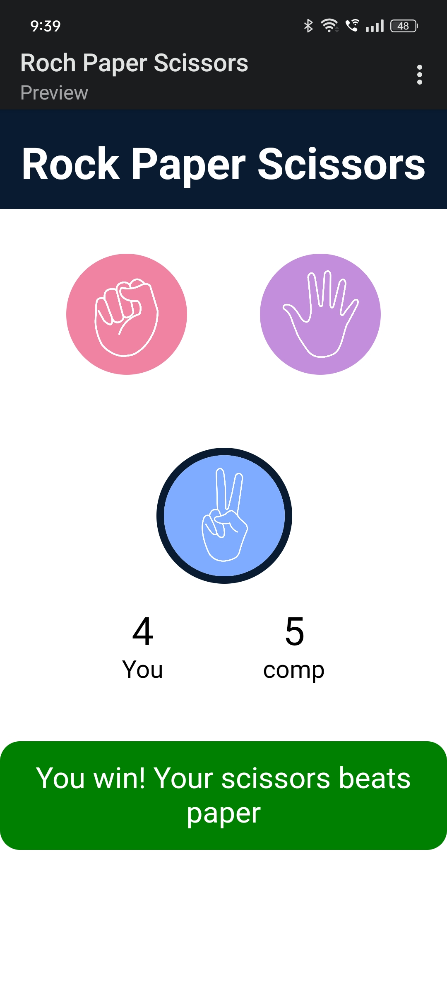
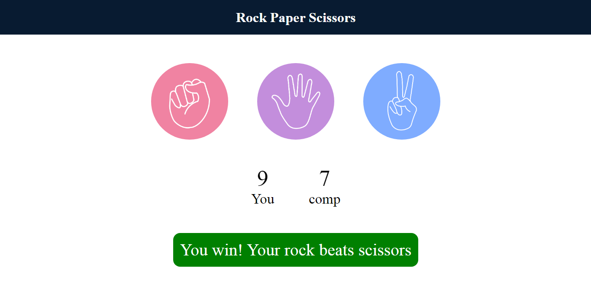

# Rock_Paper_Scissors

Welcome to my Rock-Paper-Scissors game project! 🎮

## Overview
This is a simple frontend project of the classic Rock-Paper-Scissors game. The layout of the project is designed to be responsive, adapting to different screen sizes using viewport units (vw, vh, vmin). This game keeps track of the marks gained by the user and the computer and displays it on the screen and the game will reset when either the player or the computer reaches a score of 20.

## Features
- Classic Rock-Paper-Scissors gameplay
- Responsive design for various devices
- Game resets when either player or computer reaches a score of 20

## Technologies Used
- HTML
- CSS
- JavaScript

## Project Structure
- **index.html:** The main HTML file for the game.
- **style.css:** The stylesheet containing the design and layout.
- **script.js:** JavaScript file handling game logic.
- **images:** Folder containing necessary images for the game.

## How to Play
- Clone the repository to your local machine.
- Open `index.html` in your web browser.
- Enjoy playing Rock-Paper-Scissors!

### Link

- To clone the repository:

   ```bash
   https://github.com/Rucha-Ambaliya/Roc_Paper_Scissors.git

- Feel free to fork this project and make your own improvements! If you have any questions or suggestions, don't hesitate to reach out.

### Screenshots
<div style="display: flex; justify-content: space-between;">
  
  
  
</div>

### Feedback

- If you have any feedback, suggestions, or questions, please feel free to reach out. I appreciate your interest in this project!

## Happy gaming! 🚀
